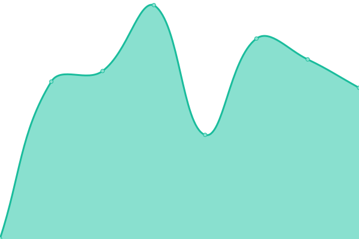
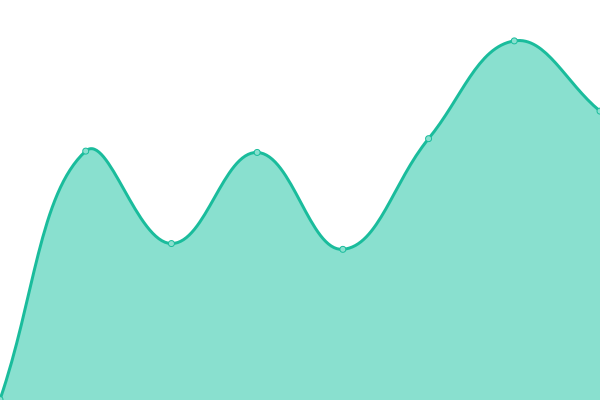
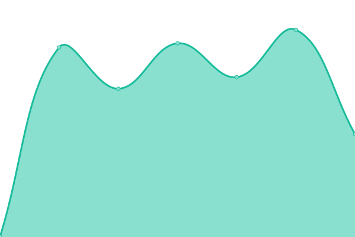

# [📈 Live Status](https://Henchman-Legal.github.io/status): <!--live status--> **🟩 All systems operational**

This repository contains the open-source uptime monitor and status page for [Henchman-Legal](https://Henchman-Legal.github.io/status), powered by [Upptime](https://github.com/upptime/upptime).

With [Upptime](https://upptime.js.org), you can get your own unlimited and free uptime monitor and status page, powered entirely by a GitHub repository. We use [Issues](https://github.com/Henchman-Legal/status/issues) as incident reports, [Actions](https://github.com/Henchman-Legal/status/actions) as uptime monitors, and [Pages](https://Henchman-Legal.github.io/status) for the status page.

<!--start: status pages-->
<!-- This summary is generated by Upptime (https://github.com/upptime/upptime) -->
<!-- Do not edit this manually, your changes will be overwritten -->
<!-- prettier-ignore -->
| URL | Status | History | Response Time | Uptime |
| --- | ------ | ------- | ------------- | ------ |
|  [Add-in](https://add-in.henchman.io) | 🟩 Up | [add-in.yml](https://github.com/Henchman-Legal/status/commits/HEAD/history/add-in.yml) | 

 562ms
     
 | 

<a href="https://status.henchman.io/history/add-in">100.00%</a>
    

|  [Search API](https://api-search.henchman.io/health) | 🟩 Up | [search-api.yml](https://github.com/Henchman-Legal/status/commits/HEAD/history/search-api.yml) | 

 433ms
     
 | 

<a href="https://status.henchman.io/history/search-api">100.00%</a>
    

|  [Dashboard](https://dashboard.henchman.io/) | 🟩 Up | [dashboard.yml](https://github.com/Henchman-Legal/status/commits/HEAD/history/dashboard.yml) | 

 567ms
     
 | 

<a href="https://status.henchman.io/history/dashboard">100.00%</a>
    

|  [Dashboard API](https://api-dashboard.henchman.io/health) | 🟩 Up | [dashboard-api.yml](https://github.com/Henchman-Legal/status/commits/HEAD/history/dashboard-api.yml) | 

 359ms
     
 | 

<a href="https://status.henchman.io/history/dashboard-api">100.00%</a>
    

<!--end: status pages-->

[**Visit our status website →**](https://Henchman-Legal.github.io/status)

## 📄 License

- Powered by: [Upptime](https://github.com/upptime/upptime)
- Code: [MIT](./LICENSE) © [Henchman-Legal](https://Henchman-Legal.github.io/status)
- Data in the `./history` directory: [Open Database License](https://opendatacommons.org/licenses/odbl/1-0/)
