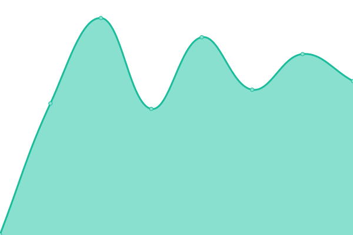
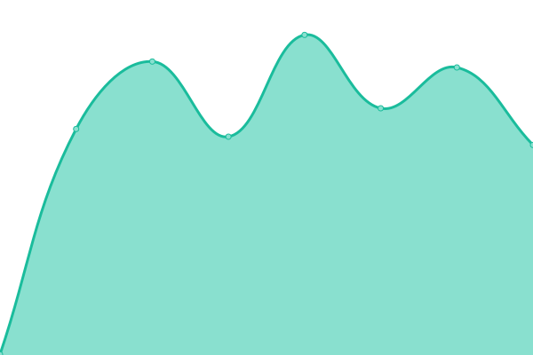
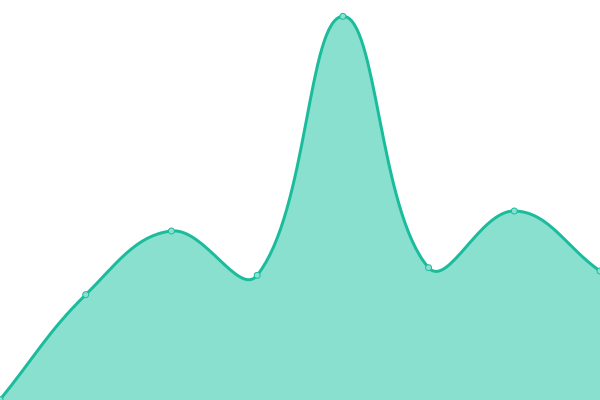
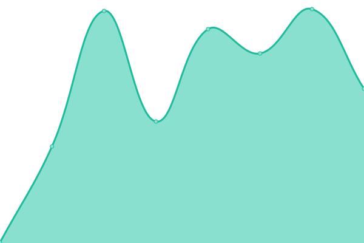
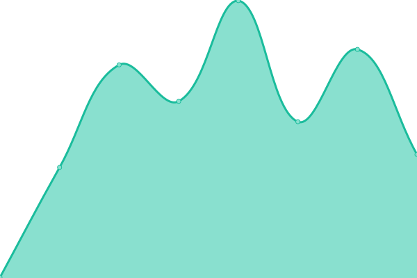

# [📈 Live Status](https://Henchman-Legal.github.io/status): <!--live status--> **🟩 All systems operational**

This repository contains the open-source uptime monitor and status page for [Henchman-Legal](https://Henchman-Legal.github.io/status), powered by [Upptime](https://github.com/upptime/upptime).

With [Upptime](https://upptime.js.org), you can get your own unlimited and free uptime monitor and status page, powered entirely by a GitHub repository. We use [Issues](https://github.com/Henchman-Legal/status/issues) as incident reports, [Actions](https://github.com/Henchman-Legal/status/actions) as uptime monitors, and [Pages](https://Henchman-Legal.github.io/status) for the status page.

<!--start: status pages-->
<!-- This summary is generated by Upptime (https://github.com/upptime/upptime) -->
<!-- Do not edit this manually, your changes will be overwritten -->
<!-- prettier-ignore -->
| URL | Status | History | Response Time | Uptime |
| --- | ------ | ------- | ------------- | ------ |
|  [Add-in (global portal)](https://add-in.lexiscreatedms.com) | 🟩 Up | [add-in-global-portal.yml](https://github.com/Henchman-Legal/status/commits/HEAD/history/add-in-global-portal.yml) | 

 413ms
     
 | 

<a href="https://status.henchman.io/history/add-in-global-portal">100.00%</a>
    

|  [Dashboard (global portal)](https://dashboard.lexiscreatedms.com/) | 🟩 Up | [dashboard-global-portal.yml](https://github.com/Henchman-Legal/status/commits/HEAD/history/dashboard-global-portal.yml) | 

 413ms
     
 | 

<a href="https://status.henchman.io/history/dashboard-global-portal">100.00%</a>
    

|  [Add-in (eu)](https://add-in.eu.lexiscreatedms.com) | 🟩 Up | [add-in-eu.yml](https://github.com/Henchman-Legal/status/commits/HEAD/history/add-in-eu.yml) | 

 427ms
     
 | 

<a href="https://status.henchman.io/history/add-in-eu">100.00%</a>
    

|  [Authentication API (eu)](https://api-auth.eu.lexiscreatedms.com/health) | 🟩 Up | [authentication-api-eu.yml](https://github.com/Henchman-Legal/status/commits/HEAD/history/authentication-api-eu.yml) | 

 455ms
     
 | 

<a href="https://status.henchman.io/history/authentication-api-eu">100.00%</a>
    

|  [Search API (eu)](https://api-search.eu.lexiscreatedms.com/health) | 🟩 Up | [search-api-eu.yml](https://github.com/Henchman-Legal/status/commits/HEAD/history/search-api-eu.yml) | 

 394ms
     
 | 

<a href="https://status.henchman.io/history/search-api-eu">100.00%</a>
    

|  [Dashboard (eu)](https://dashboard.eu.lexiscreatedms.com/) | 🟩 Up | [dashboard-eu.yml](https://github.com/Henchman-Legal/status/commits/HEAD/history/dashboard-eu.yml) | 

 392ms
     
 | 

<a href="https://status.henchman.io/history/dashboard-eu">100.00%</a>
    

|  [Dashboard API (eu)](https://api-dashboard.eu.lexiscreatedms.com/health) | 🟩 Up | [dashboard-api-eu.yml](https://github.com/Henchman-Legal/status/commits/HEAD/history/dashboard-api-eu.yml) | 

 412ms
     
 | 

<a href="https://status.henchman.io/history/dashboard-api-eu">100.00%</a>
    

|  [Add-in (us)](https://add-in.us.lexiscreatedms.com) | 🟩 Up | [add-in-us.yml](https://github.com/Henchman-Legal/status/commits/HEAD/history/add-in-us.yml) | 

 250ms
     
 | 

<a href="https://status.henchman.io/history/add-in-us">100.00%</a>
    

|  [Authentication API (us)](https://api-auth.us.lexiscreatedms.com/health) | 🟩 Up | [authentication-api-us.yml](https://github.com/Henchman-Legal/status/commits/HEAD/history/authentication-api-us.yml) | 

 197ms
     
 | 

<a href="https://status.henchman.io/history/authentication-api-us">100.00%</a>
    

|  [Search API (us)](https://api-search.us.lexiscreatedms.com/health) | 🟩 Up | [search-api-us.yml](https://github.com/Henchman-Legal/status/commits/HEAD/history/search-api-us.yml) | 

 186ms
     
 | 

<a href="https://status.henchman.io/history/search-api-us">100.00%</a>
    

|  [Dashboard (us)](https://dashboard.us.lexiscreatedms.com/) | 🟩 Up | [dashboard-us.yml](https://github.com/Henchman-Legal/status/commits/HEAD/history/dashboard-us.yml) | 

 173ms
     
 | 

<a href="https://status.henchman.io/history/dashboard-us">100.00%</a>
    

|  [Dashboard API (us)](https://api-dashboard.us.lexiscreatedms.com/health) | 🟩 Up | [dashboard-api-us.yml](https://github.com/Henchman-Legal/status/commits/HEAD/history/dashboard-api-us.yml) | 

 225ms
     
 | 

<a href="https://status.henchman.io/history/dashboard-api-us">100.00%</a>
    

|  [Add-in (ca)](https://add-in.ca.lexiscreatedms.com) | 🟩 Up | [add-in-ca.yml](https://github.com/Henchman-Legal/status/commits/HEAD/history/add-in-ca.yml) | 

 227ms
     
 | 

<a href="https://status.henchman.io/history/add-in-ca">100.00%</a>
    

|  [Authentication API (ca)](https://api-auth.ca.lexiscreatedms.com/health) | 🟩 Up | [authentication-api-ca.yml](https://github.com/Henchman-Legal/status/commits/HEAD/history/authentication-api-ca.yml) | 

 267ms
     
 | 

<a href="https://status.henchman.io/history/authentication-api-ca">100.00%</a>
    

|  [Search API (ca)](https://api-search.ca.lexiscreatedms.com/health) | 🟩 Up | [search-api-ca.yml](https://github.com/Henchman-Legal/status/commits/HEAD/history/search-api-ca.yml) | 

 226ms
     
 | 

<a href="https://status.henchman.io/history/search-api-ca">100.00%</a>
    

|  [Dashboard (ca)](https://dashboard.ca.lexiscreatedms.com/) | 🟩 Up | [dashboard-ca.yml](https://github.com/Henchman-Legal/status/commits/HEAD/history/dashboard-ca.yml) | 

 266ms
     
 | 

<a href="https://status.henchman.io/history/dashboard-ca">100.00%</a>
    

|  [Dashboard API (ca)](https://api-dashboard.ca.lexiscreatedms.com/health) | 🟩 Up | [dashboard-api-ca.yml](https://github.com/Henchman-Legal/status/commits/HEAD/history/dashboard-api-ca.yml) | 

 274ms
     
 | 

<a href="https://status.henchman.io/history/dashboard-api-ca">100.00%</a>
    

|  [Add-in (sa)](https://add-in.sa.lexiscreatedms.com) | 🟩 Up | [add-in-sa.yml](https://github.com/Henchman-Legal/status/commits/HEAD/history/add-in-sa.yml) | 

 786ms
     
 | 

<a href="https://status.henchman.io/history/add-in-sa">100.00%</a>
    

|  [Authentisation API (sa)](https://api-auth.sa.lexiscreatedms.com/health) | 🟩 Up | [authentisation-api-sa.yml](https://github.com/Henchman-Legal/status/commits/HEAD/history/authentisation-api-sa.yml) | 

 788ms
     
 | 

<a href="https://status.henchman.io/history/authentisation-api-sa">100.00%</a>
    

|  [Search API (sa)](https://api-search.sa.lexiscreatedms.com/health) | 🟩 Up | [search-api-sa.yml](https://github.com/Henchman-Legal/status/commits/HEAD/history/search-api-sa.yml) | 

 781ms
     
 | 

<a href="https://status.henchman.io/history/search-api-sa">100.00%</a>
    

|  [Dashboard (sa)](https://dashboard.sa.lexiscreatedms.com/) | 🟩 Up | [dashboard-sa.yml](https://github.com/Henchman-Legal/status/commits/HEAD/history/dashboard-sa.yml) | 

 767ms
     
 | 

<a href="https://status.henchman.io/history/dashboard-sa">100.00%</a>
    

|  [Dashboard API (sa)](https://api-dashboard.sa.lexiscreatedms.com/health) | 🟩 Up | [dashboard-api-sa.yml](https://github.com/Henchman-Legal/status/commits/HEAD/history/dashboard-api-sa.yml) | 

 777ms
     
 | 

<a href="https://status.henchman.io/history/dashboard-api-sa">100.00%</a>
    

<!--end: status pages-->

[**Visit our status website →**](https://Henchman-Legal.github.io/status)

## 📄 License

- Powered by: [Upptime](https://github.com/upptime/upptime)
- Code: [MIT](./LICENSE) © [Henchman-Legal](https://Henchman-Legal.github.io/status)
- Data in the `./history` directory: [Open Database License](https://opendatacommons.org/licenses/odbl/1-0/)
