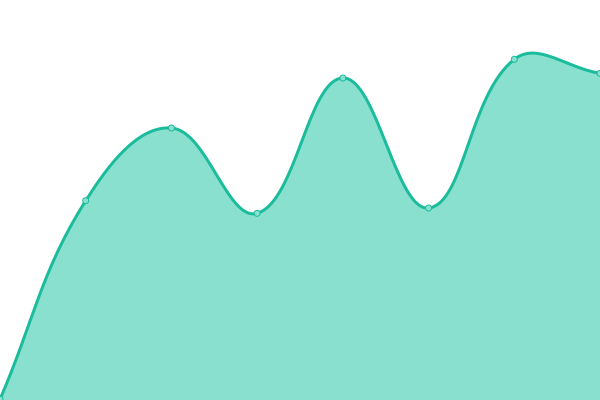
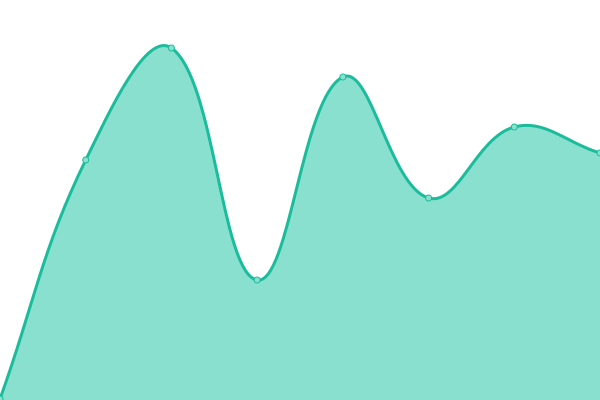
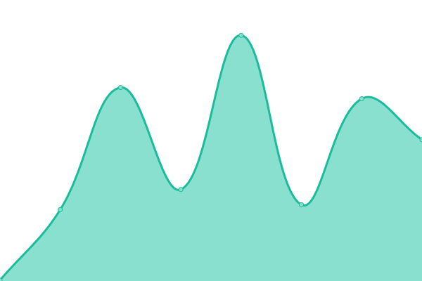
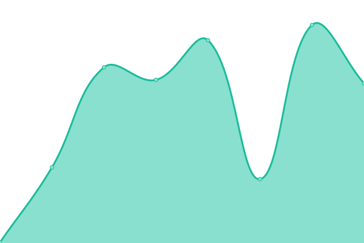

# [📈 Live Status](https://Henchman-Legal.github.io/status): <!--live status--> **🟩 All systems operational**

This repository contains the open-source uptime monitor and status page for [Henchman-Legal](https://Henchman-Legal.github.io/status), powered by [Upptime](https://github.com/upptime/upptime).

With [Upptime](https://upptime.js.org), you can get your own unlimited and free uptime monitor and status page, powered entirely by a GitHub repository. We use [Issues](https://github.com/Henchman-Legal/status/issues) as incident reports, [Actions](https://github.com/Henchman-Legal/status/actions) as uptime monitors, and [Pages](https://Henchman-Legal.github.io/status) for the status page.

<!--start: status pages-->
<!-- This summary is generated by Upptime (https://github.com/upptime/upptime) -->
<!-- Do not edit this manually, your changes will be overwritten -->
<!-- prettier-ignore -->
| URL | Status | History | Response Time | Uptime |
| --- | ------ | ------- | ------------- | ------ |
|  [Add-in (eu)](https://add-in.henchman.io) | 🟩 Up | [add-in-eu.yml](https://github.com/Henchman-Legal/status/commits/HEAD/history/add-in-eu.yml) | 

 563ms
     
 | 

<a href="https://status.henchman.io/history/add-in-eu">100.00%</a>
    

|  [Authentication API (eu)](https://api-auth.eu.henchman.io/health) | 🟩 Up | [authentication-api-eu.yml](https://github.com/Henchman-Legal/status/commits/HEAD/history/authentication-api-eu.yml) | 

 351ms
     
 | 

<a href="https://status.henchman.io/history/authentication-api-eu">100.00%</a>
    

|  [Search API (eu)](https://api-search.eu.henchman.io/health) | 🟩 Up | [search-api-eu.yml](https://github.com/Henchman-Legal/status/commits/HEAD/history/search-api-eu.yml) | 

 413ms
     
 | 

<a href="https://status.henchman.io/history/search-api-eu">100.00%</a>
    

|  [Dashboard (eu)](https://dashboard.henchman.io/) | 🟩 Up | [dashboard-eu.yml](https://github.com/Henchman-Legal/status/commits/HEAD/history/dashboard-eu.yml) | 

 485ms
     
 | 

<a href="https://status.henchman.io/history/dashboard-eu">100.00%</a>
    

|  [Dashboard API (eu)](https://api-dashboard.eu.henchman.io/health) | 🟩 Up | [dashboard-api-eu.yml](https://github.com/Henchman-Legal/status/commits/HEAD/history/dashboard-api-eu.yml) | 

 420ms
     
 | 

<a href="https://status.henchman.io/history/dashboard-api-eu">100.00%</a>
    

|  [Add-in (us)](https://add-in.us.henchman.io) | 🟩 Up | [add-in-us.yml](https://github.com/Henchman-Legal/status/commits/HEAD/history/add-in-us.yml) | 

 173ms
     
 | 

<a href="https://status.henchman.io/history/add-in-us">100.00%</a>
    

|  [Authentication API (us)](https://api-auth.us.henchman.io/health) | 🟩 Up | [authentication-api-us.yml](https://github.com/Henchman-Legal/status/commits/HEAD/history/authentication-api-us.yml) | 

 175ms
     
 | 

<a href="https://status.henchman.io/history/authentication-api-us">100.00%</a>
    

|  [Search API (us)](https://api-search.us.henchman.io/health) | 🟩 Up | [search-api-us.yml](https://github.com/Henchman-Legal/status/commits/HEAD/history/search-api-us.yml) | 

 200ms
     
 | 

<a href="https://status.henchman.io/history/search-api-us">100.00%</a>
    

|  [Dashboard (us)](https://dashboard.us.henchman.io/) | 🟩 Up | [dashboard-us.yml](https://github.com/Henchman-Legal/status/commits/HEAD/history/dashboard-us.yml) | 

 214ms
     
 | 

<a href="https://status.henchman.io/history/dashboard-us">100.00%</a>
    

|  [Dashboard API (us)](https://api-dashboard.us.henchman.io/health) | 🟩 Up | [dashboard-api-us.yml](https://github.com/Henchman-Legal/status/commits/HEAD/history/dashboard-api-us.yml) | 

 158ms
     
 | 

<a href="https://status.henchman.io/history/dashboard-api-us">100.00%</a>
    

<!--end: status pages-->

[**Visit our status website →**](https://Henchman-Legal.github.io/status)

## 📄 License

- Powered by: [Upptime](https://github.com/upptime/upptime)
- Code: [MIT](./LICENSE) © [Henchman-Legal](https://Henchman-Legal.github.io/status)
- Data in the `./history` directory: [Open Database License](https://opendatacommons.org/licenses/odbl/1-0/)
